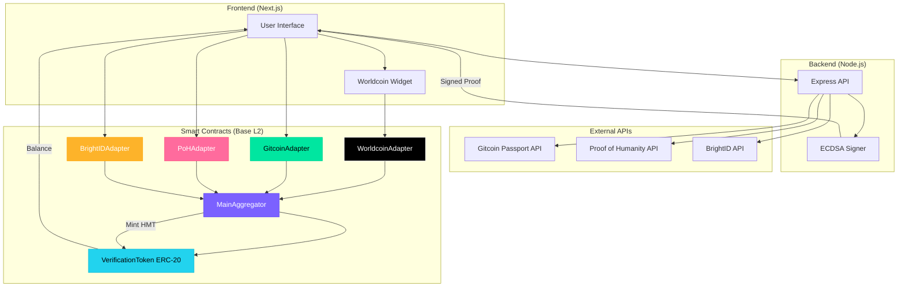
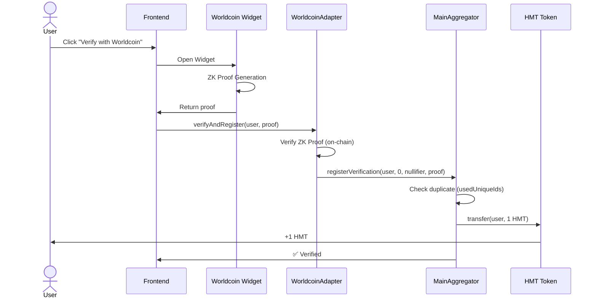
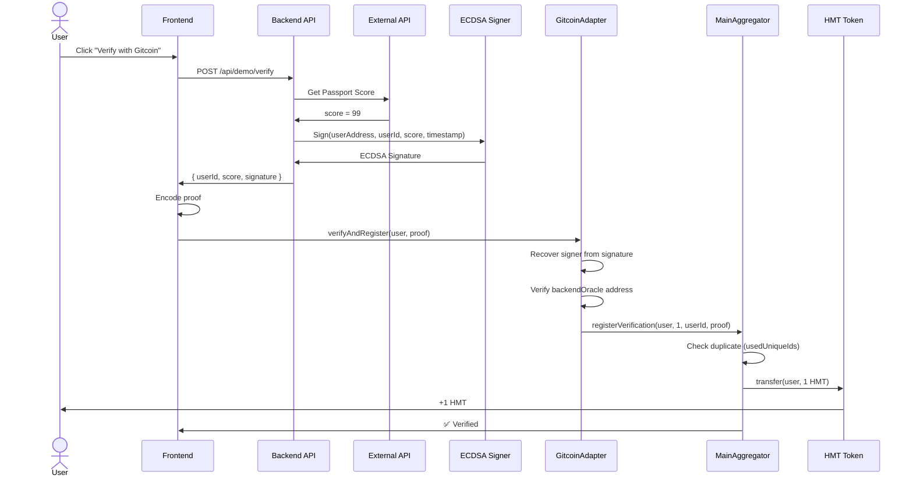
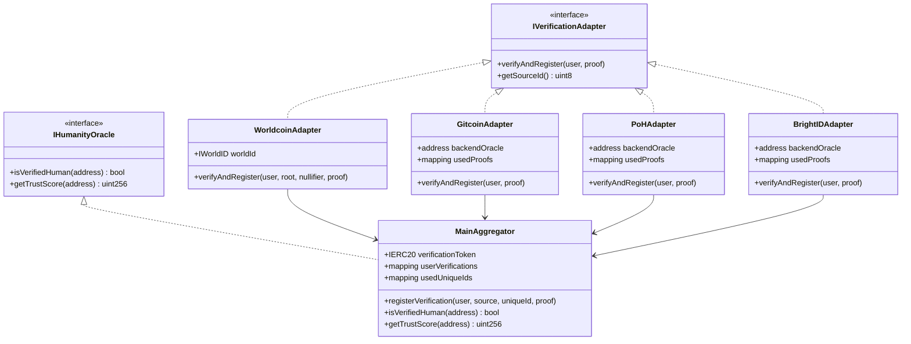
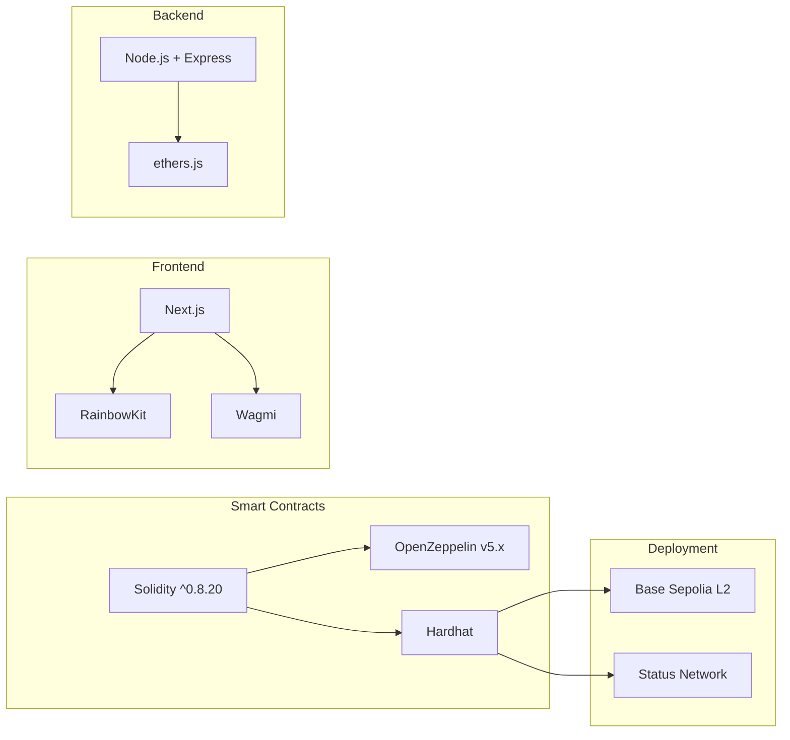
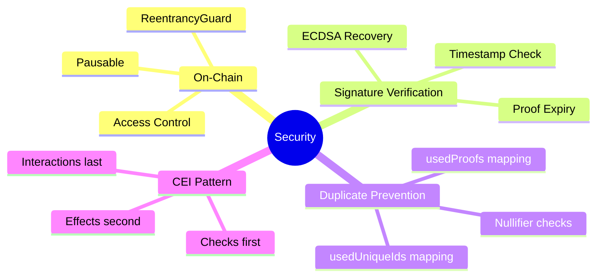

# NotABot Architecture

## System Overview

## Verification Flow

### Option 1: Worldcoin (Pure On-Chain)

### Option 2: Gitcoin/PoH/BrightID (Hybrid)

## Contract Architecture

## Tech Stack

## Security Features

## Deployment Addresses

**Base Sepolia Testnet (Chain ID: 84532)**

| Contract | Address |
|----------|---------|
| VerificationToken (HMT) | `0x9f12107874B1ED8B10AED87e19E4BDf5ea17a45B` |
| MainAggregator | `0xFcB998E4c6A0157dEF6AC724Da1279aA6Ac2743D` |
| WorldcoinAdapter | `0x...` (TBD) |
| GitcoinAdapter | `0xCd52fb37d7Ff8d164fB49274E7fd8e2b81b5710b` |
| PoHAdapter | `0xc2fF5af5C12B7085dC49415Cb81e29B8524E06C0` |
| BrightIDAdapter | `0xAeCEbf9B937D1B36C2ed5D2C2190673eA3CC82de` |

---

**Gas Costs (Base L2)**

- Worldcoin verification: ~$0.02
- Gitcoin/PoH/BrightID verification: ~$0.01
- Query `isVerifiedHuman()`: < $0.001

**Why Base L2?**
- 10x cheaper than Ethereum mainnet
- Same security (rollup to Ethereum)
- Built-in bridging with Superchain
- Native support for OP Stack

