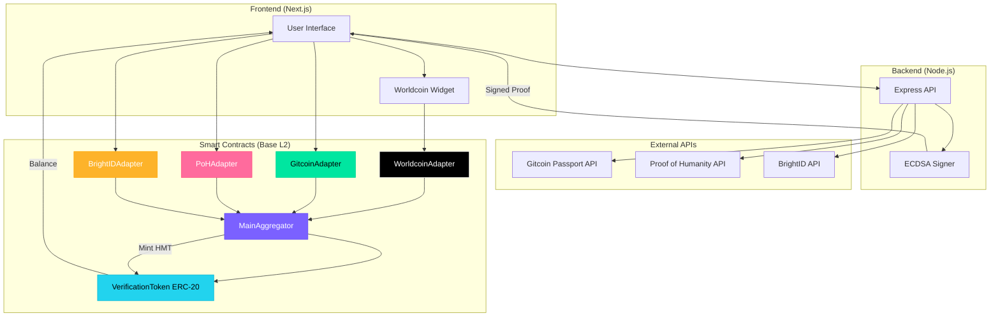
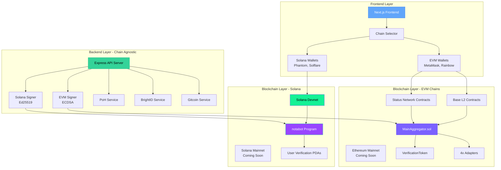
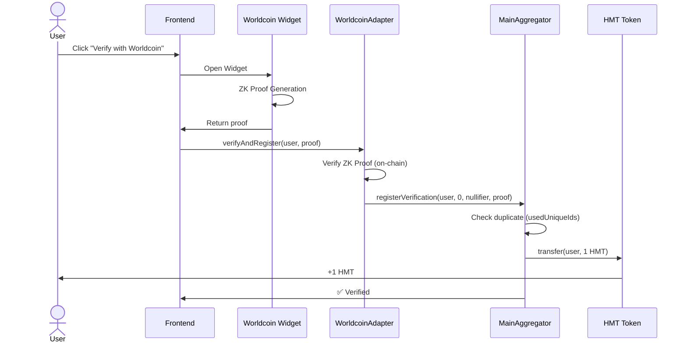
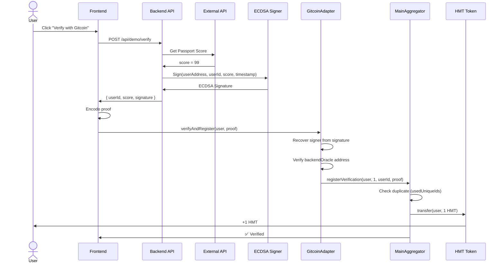
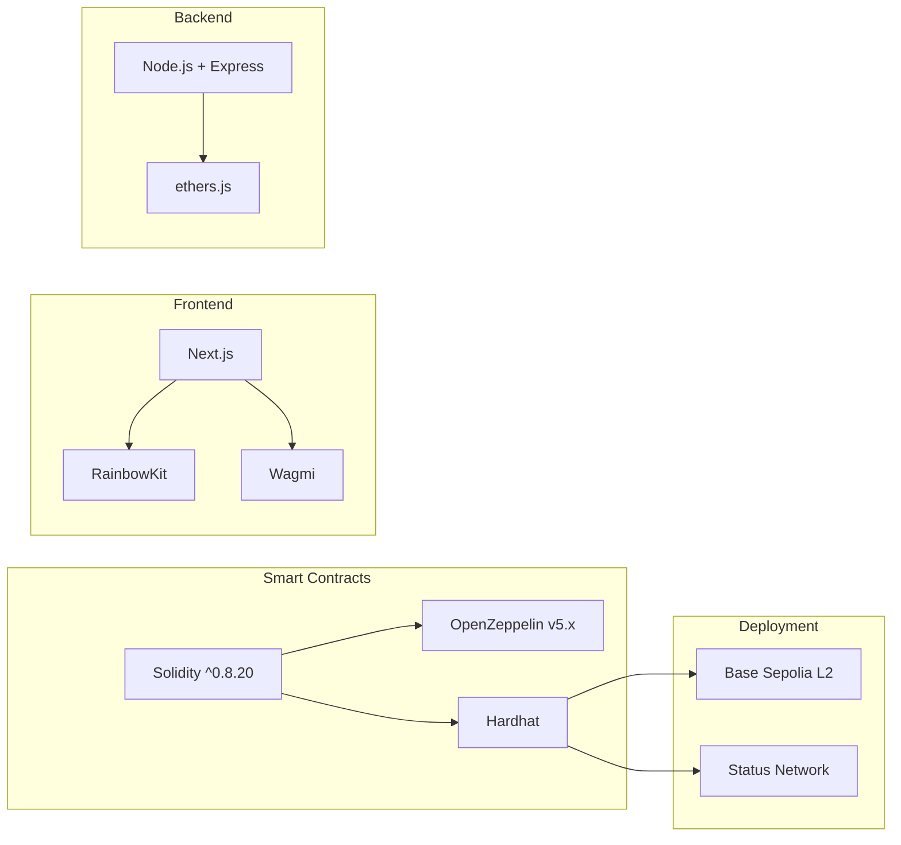
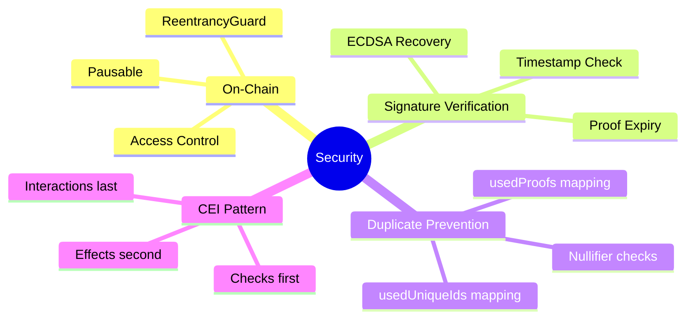

# NotABot Architecture
**Universal Multi-Chain Proof-of-Humanity Protocol**

---

## 🌐 Multi-Chain Vision

NotABot is the **first chain-agnostic identity verification protocol**.  
Verify once → Use everywhere (EVM chains + Solana + future: Aptos, Sui, etc.)

### Supported Networks

| Blockchain | Status | Network | Details |
|------------|--------|---------|---------|
| **Base L2** | ✅ Deployed | Sepolia Testnet | Primary EVM deployment |
| **Status Network** | ✅ Deployed | Testnet | Alternative EVM chain |
| **Solana** | 🆕 NEW | Devnet (deploying) | Non-EVM expansion |
| Ethereum | 🔜 Roadmap | Mainnet | Post-audit |
| Optimism | 🔜 Roadmap | Mainnet | Q2 2025 |
| Arbitrum | 🔜 Roadmap | Mainnet | Q2 2025 |

**Why Multi-Chain?**
- Different ecosystems, different users
- Solana = best for gaming (speed + cost)
- EVM = best for DeFi (liquidity + maturity)
- Users choose, we support all

---

## System Overview



---

## Multi-Chain Architecture (NEW!)



**Key Design Principles:**
- ✅ **Backend is Chain-Agnostic**: Same verification logic for all chains
- ✅ **Frontend Supports All Wallets**: Users choose their preferred chain
- ✅ **Smart Contracts Are Chain-Specific**: Optimized for each platform
- ✅ **Cross-Chain Deduplication**: Backend prevents same identity across chains

---

## Verification Flow

### Option 1: Worldcoin (Pure On-Chain)



### Option 2: Gitcoin/PoH/BrightID (Hybrid)



## Contract Architecture


## Tech Stack



## Security Features



## Deployment Addresses

**Base Sepolia Testnet (Chain ID: 84532)**

| Contract | Address |
|----------|---------|
| VerificationToken (HMT) | `0x9f12107874B1ED8B10AED87e19E4BDf5ea17a45B` |
| MainAggregator | `0xFcB998E4c6A0157dEF6AC724Da1279aA6Ac2743D` |
| WorldcoinAdapter | `0x...` (TBD) |
| GitcoinAdapter | `0xCd52fb37d7Ff8d164fB49274E7fd8e2b81b5710b` |
| PoHAdapter | `0xc2fF5af5C12B7085dC49415Cb81e29B8524E06C0` |
| BrightIDAdapter | `0xAeCEbf9B937D1B36C2ed5D2C2190673eA3CC82de` |

---

**Gas Costs (Base L2)**

- Worldcoin verification: ~$0.02
- Gitcoin/PoH/BrightID verification: ~$0.01
- Query `isVerifiedHuman()`: < $0.001

**Why Base L2?**
- 10x cheaper than Ethereum mainnet
- Same security (rollup to Ethereum)
- Built-in bridging with Superchain
- Native support for OP Stack

---

## 🌟 Solana Integration (NEW!)

**Solana Devnet Deployment (In Progress)**

### Why Solana?

**The Sybil Problem Paradox:**
- Solana transactions cost ~$0.00025 (400x cheaper than Base L2)
- Creating 10,000 fake wallets costs ~$2.50 vs $20,000 on Ethereum
- **Result:** Best UX + Worst Sybil problem = WE'RE NEEDED MOST HERE


### Solana Program Architecture

```
Program: notabot.so
├── Instructions:
│   ├── initialize_verification(user: Pubkey)
│   ├── verify_user(source: String, unique_id: String)
│   ├── is_verified(user: Pubkey) -> bool
│   └── get_trust_score(user: Pubkey) -> u64
│
├── Accounts:
│   ├── UserVerification PDA (per user)
│   │   ├── user: Pubkey
│   │   ├── is_verified: bool
│   │   ├── source: String
│   │   ├── trust_score: u64
│   │   └── timestamp: i64
│   │
│   └── OracleAuthority (global)
│       └── authorized_signers: Vec<Pubkey>
│
└── Security:
    ├── PDA-based authority (not msg.sender)
    ├── Backend Ed25519 signatures
    └── Cross-chain deduplication (via backend DB)
```

### Deployment Plan

**Phase 1: Hackathon (Now)**
- ✅ Architecture designed
- 🚧 Rust program implementation
- 🚧 Anchor tests
- ⏳ Devnet deployment
- ⏳ Frontend integration

**Phase 2: Testnet (Post-Hackathon)**
- Security audit (OtterSec or Neodyme)
- Load testing (10k+ verifications)
- Beta program (invite Solana GameFi projects)

**Phase 3: Mainnet (Month 3)**
- Production deployment
- Multi-sig authority (3-of-5)
- Insurance coverage (Nexus Mutual)
- Monitoring & alerting

### Documentation

For detailed Solana architecture:
📖 **[packages/solana/ARCHITECTURE.md](./packages/solana/ARCHITECTURE.md)**
---
### Technical Excellence

**What Makes Us Different:**
1. ✅ **First Multi-Chain PoH Aggregator** (pioneer advantage)
2. ✅ **Chain-Agnostic Backend** (easy to add new chains)
3. ✅ **Universal Interface** (same API for all chains)
4. ✅ **Already Proven** (ETH Bishkek 2025 winners 🏆)

---


