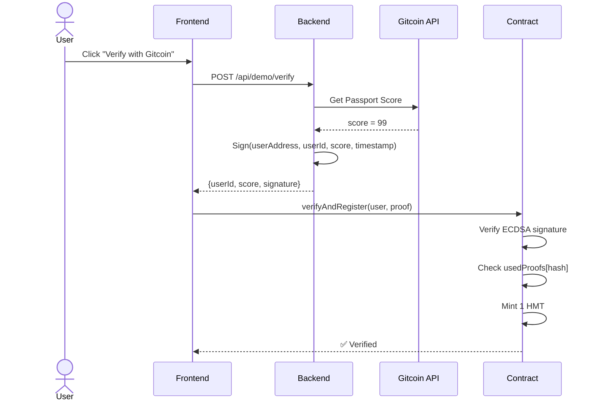
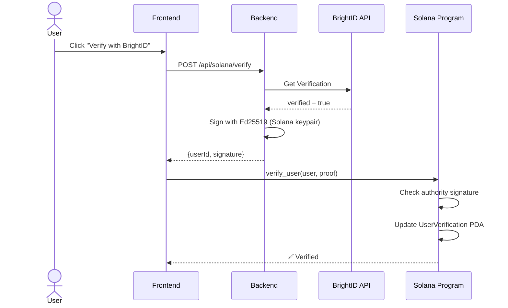

# NotABot Architecture
**Production-Grade Multi-Chain Identity Protocol**

---

## Current Status

**Stage:** Post-Hackathon MVP → Production  
**Users:** <10 (growth phase)  
**Architecture:** Modular Monolith (intentional)

---

## 🏗️ System Architecture

### High-Level Overview

```
┌─────────────────────────────────────────────────────────┐
│                     FRONTEND LAYER                       │
│  Next.js App (packages/nextjs/)                         │
│  - RainbowKit (EVM wallets)                             │
│  - Phantom/Solflare integration (Solana)                │
│  - Chain selector UI                                     │
└─────────────────┬───────────────────────────────────────┘
                  │ HTTP/HTTPS
                  ↓
┌─────────────────────────────────────────────────────────┐
│                     BACKEND LAYER                        │
│  Node.js + Express (packages/backend/)                  │
│  ┌─────────────────────────────────────────────────┐   │
│  │ API Gateway (server.js)                         │   │
│  │ - Rate limiting (express-rate-limit)            │   │
│  │ - Request validation (middleware/validators.js) │   │
│  │ - Error handling                                 │   │
│  └─────────────────────────────────────────────────┘   │
│  ┌─────────────────────────────────────────────────┐   │
│  │ Verification Services (services/)               │   │
│  │ - gitcoin.js (Passport API)                     │   │
│  │ - poh.js (Proof of Humanity)                    │   │
│  │ - brightid.js (BrightID Graph)                  │   │
│  │ - solana.js (Solana RPC calls)                  │   │
│  └─────────────────────────────────────────────────┘   │
│  ┌─────────────────────────────────────────────────┐   │
│  │ Signing Service (services/signer.js)            │   │
│  │ - ECDSA signing (EVM chains)                    │   │
│  │ - Ed25519 signing (Solana)                      │   │
│  │ - Nonce management                               │   │
│  └─────────────────────────────────────────────────┘   │
└─────────────┬───────────────────────┬───────────────────┘
              │                       │
      Signed Proofs             Signed Proofs
              ↓                       ↓
┌─────────────────────────┐   ┌────────────────────────────┐
│   EVM CONTRACTS         │   │   SOLANA PROGRAM           │
│   (packages/hardhat/)   │   │   (solana/)                │
│                         │   │                            │
│  MainAggregator.sol     │   │  notabot.so (Rust/Anchor) │
│  ├─ WorldcoinAdapter    │   │  ├─ verify_user()          │
│  ├─ GitcoinAdapter      │   │  ├─ is_verified()          │
│  ├─ PoHAdapter          │   │  └─ get_trust_score()      │
│  ├─ BrightIDAdapter     │   │                            │
│  └─ VerificationToken   │   │  UserVerification PDA      │
│                         │   │  (per-user account)        │
│  Networks:              │   │                            │
│  - Base Sepolia ✅      │   │  Networks:                 │
│  - Status Network ✅    │   │  - Devnet 🚧               │
│  - Ethereum (roadmap)   │   │  - Mainnet (Q2 2025)       │
└─────────────────────────┘   └────────────────────────────┘
```

---

## 🔐 Security Architecture

### 1. **Signature-Based Verification (Hybrid Model)**

**Why Hybrid?**
- ✅ External APIs (Gitcoin, PoH) can't be called on-chain
- ✅ Cross-chain deduplication needs centralized check
- ✅ Cheaper + simpler for MVP

**Flow:**
```
1. User requests verification → Backend
2. Backend calls External API (Gitcoin)
3. Backend signs proof with private key
4. Frontend submits proof → Smart Contract
5. Contract verifies signature (ECDSA.recover)
6. Contract checks: signer == trustedOracle
7. Contract mints 1 HMT token
```

**Security Controls:**
- ✅ Nonce-based replay protection
- ✅ Timestamp expiry (1 hour max)
- ✅ Rate limiting (10 req/min per IP)
- ✅ Private key in Railway secrets (not in code)

### 2. **On-Chain Anti-Sybil**

```solidity
mapping(bytes32 => bool) usedUniqueIds;  // Global dedup
mapping(bytes32 => bool) usedProofs;     // Per-adapter dedup
```

**Prevention:**
- Same `uniqueId` can't be used twice (Gitcoin passport ID, PoH address, etc.)
- Same proof signature can't be replayed

### 3. **Access Control**

```solidity
// MainAggregator.sol
mapping(address => bool) public trustedAdapters;

function registerVerification(...) external {
    require(trustedAdapters[msg.sender], "Only adapters");
    // ...
}
```

Only owner can add/remove adapters → prevents unauthorized minting

---

## 📊 Data Flow

### EVM Chain Verification (Gitcoin Example)



### Solana Verification (Same Logic, Different Chain)



---

## 🌉 Multi-Chain Design

### Backend is Chain-Agnostic

```javascript
// packages/backend/src/server.js

// ✅ Same endpoint for all chains
app.post('/api/verify', async (req, res) => {
  const { chain, source, userAddress } = req.body;
  
  // 1. Call external API (chain-agnostic)
  const result = await verifySource(source, userAddress);
  
  // 2. Sign proof (chain-specific)
  let signature;
  if (chain === 'solana') {
    signature = await signEd25519(result);
  } else {
    signature = await signECDSA(result);  // EVM chains
  }
  
  return res.json({ proof: signature });
});
```

### Contracts are Chain-Specific

```
packages/hardhat/contracts/  → Solidity (EVM chains)
solana/programs/notabot/     → Rust/Anchor (Solana)
```

**Why not unified?**
- Different VM models (EVM vs Solana runtime)
- Different security patterns (msg.sender vs PDA authority)
- Different cost models (gas vs rent)

---

## 🛠️ Technology Stack

### Frontend (`packages/nextjs/`)

| Component | Technology | Why |
|-----------|-----------|-----|
| Framework | Next.js 15 + TypeScript | SSR, API routes, type safety |
| Styling | TailwindCSS + DaisyUI | Fast prototyping, modern UI |
| EVM Wallet | RainbowKit + Wagmi | Multi-wallet support |
| Solana Wallet | @solana/wallet-adapter | Phantom, Solflare support |
| State | React hooks + Zustand | Simple, no Redux overhead |

### Backend (`packages/backend/`)

| Component | Technology | Why |
|-----------|-----------|-----|
| Runtime | Node.js 20 + Express | Fast dev, rich ecosystem |
| Language | JavaScript | Same as frontend (team velocity) |
| Signing | ethers.js (EVM) + @solana/web3.js | Standard libraries |
| Validation | express-validator | Input sanitization |
| Logging | Winston | Structured logs for Railway |
| Deployment | Railway | Zero-config, $5/month |

**Why NOT Go/Rust?**
- Node.js handles 100k+ users easily
- Team knows JS → faster iteration
- Can rewrite critical paths later if needed

### Smart Contracts (`packages/hardhat/`)

| Component | Technology | Why |
|-----------|-----------|-----|
| Language | Solidity ^0.8.20 | Industry standard for EVM |
| Framework | Hardhat | Best testing, debugging |
| Libraries | OpenZeppelin v5.x | Battle-tested security |
| Network | Base L2 | 10x cheaper than Ethereum |
| Tests | Mocha + Chai | 26/26 tests passing |

### Solana Program (`solana/`)

| Component | Technology | Why |
|-----------|-----------|-----|
| Language | Rust | Only option for Solana |
| Framework | Anchor | Most popular, good DX |
| Network | Devnet (now) | Testing before mainnet |
| Tests | Mocha + @coral-xyz/anchor | Same testing style as contracts |

---

## Repo Structure

```
/notabot (monorepo)
│
├── packages/
│   ├── hardhat/               # EVM smart contracts
│   │   ├── contracts/
│   │   │   ├── core/
│   │   │   │   ├── MainAggregator.sol
│   │   │   │   └── VerificationToken.sol
│   │   │   ├── integrations/
│   │   │   │   ├── WorldcoinAdapter.sol
│   │   │   │   ├── GitcoinAdapter.sol
│   │   │   │   ├── PoHAdapter.sol
│   │   │   │   └── BrightIDAdapter.sol
│   │   │   └── interfaces/
│   │   │       ├── IHumanityOracle.sol
│   │   │       └── IVerificationAdapter.sol
│   │   ├── test/              # 26 unit tests
│   │   ├── deploy/            # Hardhat deploy scripts
│   │   └── deployments/       # Deployed addresses
│   │
│   ├── backend/               # Node.js API server
│   │   ├── src/
│   │   │   ├── server.js      # Express app + routes
│   │   │   ├── services/
│   │   │   │   ├── gitcoin.js
│   │   │   │   ├── poh.js
│   │   │   │   ├── brightid.js
│   │   │   │   ├── signer.js   # ECDSA + Ed25519
│   │   │   │   └── solana.js
│   │   │   ├── middleware/
│   │   │   │   └── validators.js
│   │   │   ├── config/
│   │   │   │   └── env.js
│   │   │   └── utils/
│   │   │       └── logger.js
│   │   └── test/
│   │       └── api.test.js
│   │
│   ├── nextjs/                # Frontend app
│   │   ├── app/
│   │   │   ├── page.tsx       # Home
│   │   │   ├── notabot/       # Verification UI
│   │   │   ├── live/          # Live dashboard
│   │   │   └── analytics/     # Metrics
│   │   ├── components/
│   │   │   ├── Header.tsx
│   │   │   ├── VerificationBadge.tsx
│   │   │   └── SolanaVerify.tsx
│   │   └── hooks/
│   │       ├── useVerificationHistory.ts
│   │       └── useSolanaVerification.ts
│   │
│   └── solana/                # Solana program (Rust)
│       ├── programs/notabot/
│       │   └── src/
│       │       ├── lib.rs
│       │       ├── instructions/
│       │       └── state/
│       └── tests/
│           └── notabot.ts
│
├── docs/
│   ├── ARCHITECTURE.md        # ← This file
│   ├── 4STEPSPROD.MD          # Production roadmap
│   ├── INTEGRATION.md         # 5-min integration guide
│   └── DEMO_SCRIPT.md
│
├── infrastructure/            # Coming soon
│   ├── terraform/
│   └── docker/
│
└── package.json               # Root workspace config
```

**Why Monorepo?**
- ✅ Shared TypeScript types
- ✅ Single `yarn install`
- ✅ Atomic commits across layers
- ✅ Easier to refactor

---

## 🚀 Deployment Architecture

### Current (MVP)

```
┌──────────────┐
│   Vercel     │  Frontend (Next.js)
│ (Edge CDN)   │  - Automatic deploys from main
└──────────────┘
       ↓ API calls
┌──────────────┐
│   Railway    │  Backend (Node.js)
│  (us-west)   │  - Single instance
│              │  - Auto-restart on crash
└──────────────┘
       ↓ Contract calls
┌──────────────┬──────────────┐
│  Base L2     │  Solana      │
│  (Sepolia)   │  (Devnet)    │
└──────────────┴──────────────┘
```

**Cost:** ~$5/month (Railway) + $0 (Vercel free tier)

### Future (Production - when >10k users)

```
┌──────────────┐
│  Cloudflare  │  CDN + WAF + DDoS protection
└──────┬───────┘
       ↓
┌──────────────┐
│   Next.js    │  Deployed on Vercel (Edge)
└──────┬───────┘
       ↓
┌──────────────────────────────┐
│   Backend (Horizontal Scale) │
│   ┌────┐ ┌────┐ ┌────┐      │
│   │ N1 │ │ N2 │ │ N3 │      │  Railway Pro
│   └────┘ └────┘ └────┘      │  (auto-scaling)
│         Load Balancer         │
└──────────────────────────────┘
       ↓
┌─────────────────┐
│   PostgreSQL    │  Store verification history
│   (Supabase)    │  (for analytics)
└─────────────────┘
```

**Cost:** ~$50/month (Railway Pro + Supabase)

---

## 🔄 Scalability Plan

### Current Bottlenecks (at 10k+ users)

| Component | Limit | Solution |
|-----------|-------|----------|
| Backend | Single instance (1 CPU) | Add horizontal replicas |
| API Rate | 10 req/sec | Add Redis rate limiter |
| Logs | Railway stdout | Switch to Datadog/LogFlare |
| Signing | Single keypair | Add HSM (AWS KMS) |

### When to Scale?

**DON'T scale prematurely!**

Current architecture handles:
- ✅ 1,000 users/day
- ✅ 100 verifications/hour
- ✅ <100ms response time

Only refactor when:
- ❌ Response time >500ms
- ❌ Error rate >1%
- ❌ Costs >$500/month

---

## 🧪 Testing Strategy

### Smart Contracts (Hardhat)

```bash
cd packages/hardhat
npx hardhat test              # All tests
npx hardhat coverage          # Code coverage
```

**Coverage Goals:**
- Core contracts: 100%
- Adapters: >90%
- Interfaces: N/A (no logic)

**Test Categories:**
1. Unit tests (per function)
2. Integration tests (adapter → aggregator)
3. Edge cases (zero address, duplicate IDs)
4. Access control (onlyOwner, trusted adapters)

### Backend (Node.js)

```bash
cd packages/backend
npm test                      # Jest tests
npm run test:coverage
```

**Test Categories:**
1. API endpoints (POST /verify)
2. Signature generation (ECDSA + Ed25519)
3. External API mocks (Gitcoin, PoH)
4. Error handling (invalid input, timeouts)

### Frontend (Next.js)

```bash
cd packages/nextjs
yarn test                     # Vitest
yarn test:e2e                 # Playwright (coming soon)
```

**Test Categories:**
1. Component rendering (VerificationBadge)
2. Wallet connection (RainbowKit, Phantom)
3. Contract interactions (wagmi hooks)

### Solana Program (Rust)

```bash
cd solana
anchor test
```

**Test Categories:**
1. Instruction execution (verify_user)
2. PDA creation (UserVerification)
3. Authority checks (only oracle can verify)

---

## 🛡️ Security Checklist

### Before Mainnet

- [ ] Smart contract audit (OpenZeppelin, Trail of Bits)
- [ ] Backend penetration test
- [ ] Bug bounty program (Immunefi)
- [ ] Multi-sig for contract ownership (Gnosis Safe)
- [ ] Private key in HSM (AWS KMS or Hardware wallet)
- [ ] Rate limiting (100 req/min per IP)
- [ ] DDoS protection (Cloudflare)
- [ ] Input validation (all API endpoints)
- [ ] SQL injection prevention (parameterized queries)
- [ ] XSS prevention (Content-Security-Policy)

---

## 📈 Monitoring & Observability

### Current (MVP)

- Railway logs (stdout)
- Vercel analytics (free tier)
- Manual monitoring (check logs when something breaks)

### Future (Production)

```
┌─────────────┐
│   Backend   │ ──→ logs ──→ Datadog / LogFlare
│             │ ──→ metrics ──→ Prometheus
│             │ ──→ traces ──→ OpenTelemetry
└─────────────┘

Alerts:
- Error rate >1% → Slack
- Response time >500ms → Email
- Backend down → PagerDuty
```

**Key Metrics:**
- Verifications per hour
- Success rate by source (Gitcoin, PoH, etc.)
- Gas costs (EVM) vs rent costs (Solana)
- API response times

---

## 🎯 Next Steps

### Phase 1: Documentation (48 hours) ← YOU ARE HERE
- [x] Create ARCHITECTURE.md
- [ ] Create 4STEPSPROD.MD
- [ ] Add OpenAPI spec for backend

### Phase 2: Production Readiness (1 week)
- [ ] Add PostgreSQL for verification history
- [ ] Add Redis for rate limiting
- [ ] Set up Datadog monitoring
- [ ] Deploy to mainnet (Base L2)

### Phase 3: Multi-Chain (2 weeks)
- [ ] Finish Solana program
- [ ] Deploy to Solana mainnet
- [ ] Add Optimism + Arbitrum support
- [ ] Cross-chain deduplication DB

### Phase 4: Enterprise Features (1 month)
- [ ] API keys for dApps
- [ ] Usage-based billing (Stripe)
- [ ] Compliance dashboard (AML/KYC)
- [ ] White-label option

---

## 📚 Resources

- [Integration Guide (5 minutes)](./INTEGRATION.md)
- [API Documentation](../packages/backend/API.md)
- [Solana Architecture](../solana/ARCHITECTURE.md)
- [Security Audit Report](./AUDIT.md) (coming soon)

---

**Built by NotABot Team | ETH Bishkek 2024 Winners | MIT License**

